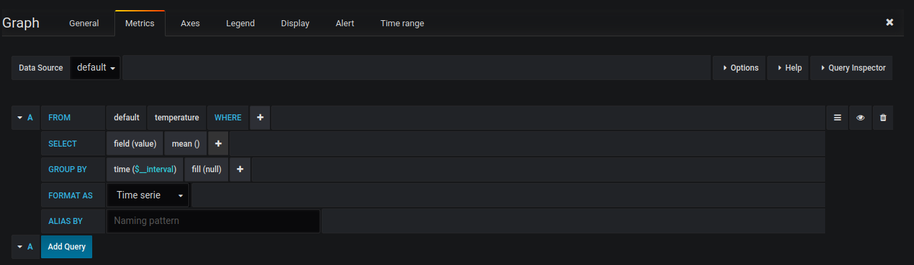
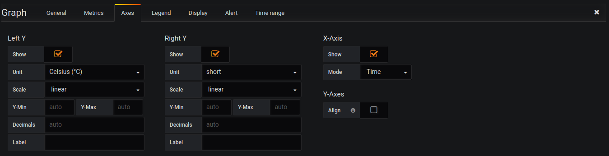
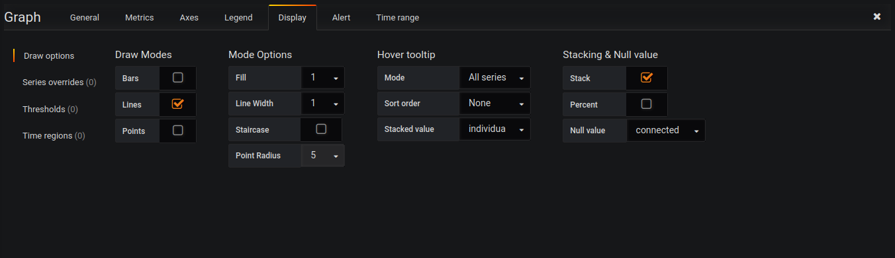
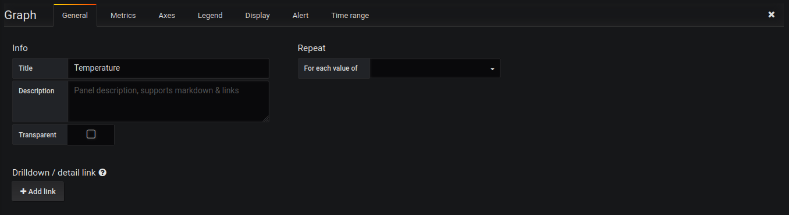
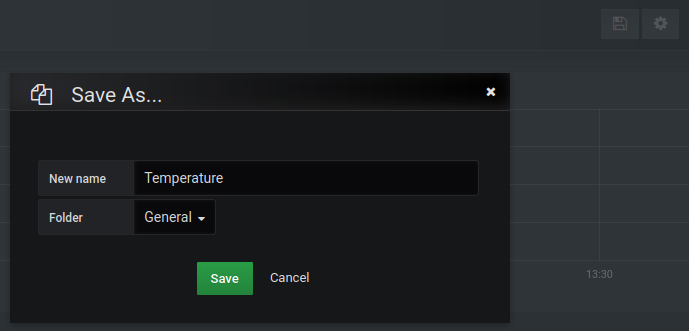
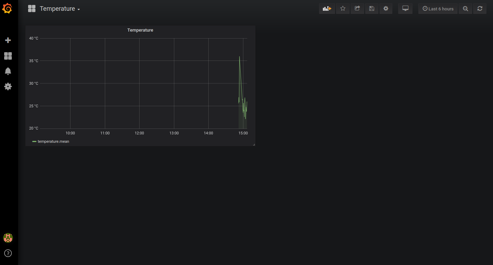

# SIN 492 - Internet das Coisas - Aula Prática 5
### 2022-1
**Descrição**: Nesta aula prática o estudante criará um seriço de Monitoramento IoT baseado nas ferramentas: [Docker](https://www.docker.com/), [Mosquitto](https://mosquitto.org), [InfluxDB](https://www.influxdata.com/), [Grafana](https://grafana.com/). A construção do cenário considera conhecimento prévio em Comunicação em Rede de Computadores e Programação de Computadores.

**Objetivos**: Com esta aula o estudante ficará apto a construir Aplicações IoT utilizando ferramentas atuais do mercado.

**Método**: Laboratório Prático (PVA 227), com instruções procedural documentadas e apoio individualizado no processo de execução do laboratório.

**Prazo de Entrega**: 06/07/2022 21:00 Horas.

### Passos:
1. Inicialize o PC do Laboratório PVA 227 com Ubuntu. (Utilize seta para baixo no processo de Boot.)
2. Logue com user and pass (aluno, 123456)
3. `sudo apt-get update` &rarr; Atualização para que o Ubuntu instale os pacotes mais recentes.
4. `sudo apt-get install containerd git` &rarr; Para suporte do Ubuntu para containers.
5. `sudo apt-get install docker.io docker-compose` &rarr; Para que possamos utilizar Containers Docker na máquina
6. `sudo apt-get install python3-pip`&rarr; Para ser possível instalar posteriormente pacotes Python.
7. `sudo usermod -aG docker ${USER}` &rarr; Para que o usuário ''aluno'' receba upgrade de sudo para rodar comandos Docker. Dê reboot na máquina e logue novamente com Ubuntu, neste ponto as configurações terão sido aplicadas.
8. Clone o Repositório no GitHub: `git cone https://github.com/romoreira/SIN492-Aula-Pratica-5`
9. Abra o diretório  **SIN492-Aula-Pratica-5/00-docker**:  `cd SIN492-Aula-Pratica-5/00-docker` &rarr; o arquivo de deployment da aula está nesse diretório.
10. Torne-se seu usuario aluno **sudo**: `sudo su` &rarr; Criaremos os deployment do serviço nesse modo.
11. Crie uma variável de ambiente *DATA_DIR* onde os logs da Aplicação IoT irão ser registrados: `export DATA_DIR=/tmp`
12. Crie o diretório para registro de logs do *Mosquitto*, *InfluxDB* e *Grafan*a: `mkdir -p ${DATA_DIR}/mosquitto/data ${DATA_DIR}/mosquitto/log ${DATA_DIR}/influxdb ${DATA_DIR}/grafana`
13. Altere a permissão (*ownership*) dos diretórios criados:
* `sudo chown -R 1883:1883 ${DATA_DIR}/mosquitto`
* `sudo chown -R 472:472 ${DATA_DIR}/grafana`
14. Faça o deployment da Aplicação com o comando: `docker-compose up -d`
> **_NOTE:_**  Nsse momento serão criados Containers (Docker) das Aplicações: Mosquitto (Broker IoT), InfluxDB (Banco de Dados para armazenar de forma persistente as informações enviadas pelos sensores), MqttBridge (Pipeline de dados dos sensores e armazenamento dentro do Banco de Dados) e Grafana (para apresentação dos dados coletados pelos sensores IoT)

15. Verifique se os containers estão no *status* de **Up**: `docker ps -a`
16. Note as portas de rede onde os serviços estão expondo suas funcionalidades (conforme saída do comando acima):
* 3000 - Grafana
* 1883 - Mosquitto
* 8086 - InfluxDB
17. Abra o Browser (Firefox) e tente acessar o seriço Grafana: `http://127.0.0.1:3000/` *Usuário:* `admin` e *Password:* `admin` (Será pedida a alteração da senha no primeiro login, mantenha a mesma :grinning: ).
18. Vá em *Configuration* &rarr; *Data Sources*  &rarr; *Add data source*
19. Escolha o Data source type: *InfluxDB* e Preencha os campos para conexão com o banco de dados conforme abaixo:
* Name: *InfluxDB*
* URL: http://influxdb:8086
* Database: *iothon_db*
* User: *root*
* Password: *root*
* Clique em: `Save & Test`
Note que ao clicar em salvar, aparecerá o resultado do teste acima do botão, se tudo estiver correto, aparecerá: _Data source is working_.
20. Clique em `Back`
21. Clique em *Create* &rarr; *Dashboard* &rarr; *Graph* (No menu esquerdo pelo icone de mais +)
22. Neste ponto terá aparecido um gráfico sem nenhuma informação. Por enquanto vamos deixar assim, não clique fora dessa área. :upside_down_face:
___
A partir de agora, precisamos povoar o Banco de Dados (InfluxDB) com informações relacionados às coletas dos sensores IoT. Como não temos sensores IoT, usaremos um script em Python que atuará como tal.

23. Abra uma nova aba no Terminal `CTRL + Shift + T` (ou outro Terminal) e instale o seguinte pacote: `pip3 install paho-mqtt` e `pip install paho-mqtt` &rarr; com esse cliente é possível publicar dados em um Broker MQTT.
24. Abra o diretório *03-iotclient* por meio dos comandos: `cd 03-iotclient`. Note dentro do arquivo `iot-sensor.py` algumas informações importantes (digite o comando: `nano iot-sensor.py`:
* O Endereço IP do Broker: 127.0.0.1
* A Porta do Serviço de Rede: 1883
* O Tópico dentro do Mosquitto que ele está escrevendo os valores: `iothon/bme280/temperature` &rarr; **bme280** é a referência à um sensor de temperatura (*fake*) e **temperature** é sua percepção do ambiente.
* Esse script fica a cada dois segundos mandando um número aleatório para o Broker MQTT. esse número aleatório simula um sensor de temperatura. Fique a contade para alterar o range de temperatura.
* Saia da edição sem alterar nada (caso queira pode alterar): `CTRL + X`
24. Vamos colocar esse sensor IoT para mandar os dados para o MQTT Broker, para isso rode o sensor com o seguinte comando: `python3 iot-sensor.py` &rarr; note que a saída informará que estão sendo enviados dados para o Broker.
___
Vamos retomar para o Browser (Firefox) e terminar de configurar os dados para que eles apareçam no Gráfico.
> **_NOTE:_** Note que nesse ponto nenhuma informação está sendo exibida no gráfico, faremos essa configuração agora. :wink:
25. Clique na seta *Panel Title* acima do gráfico e esoclha a opção `Edit`
26. Agora, deverá estar aparecendo as configurações: `Metrics`, vamos ajustar alguns parâmetros de busca no Banco de Dados conforme abaixo:

Configuração do nome do eixo-Y (y-Axis) para Temperatura em Celsius:

Configuração da ligação entre os pontos do grafico (TimeSeries): se nulo ligue os últimos pontos:

Nome do Gráfico *Temperatura*:

27. Clique a opção salvar no canto superior direito e dê um nome ao Dashboard, *Temperatura*. Conforme imagem abaixo.
Processo de *Save* do dashboard, menu direito superior para salvar:

28. Agora na tela inicial: *Dashboards* &rarr; *Home* note que as informações de temperatura (*fake*) estarão aparecendo no gráfico. Tudo isso euquanto o cliente estiver mandando seus dados. Veja imagem abaixo:

### Nesse ponto, você pode imaginar quantas aplicações ou sensores poderiam ser construídas a partir desse deplyoment? Quantos dashboards poderiam ser criados?

### Quais tipos de gráficos poderiam ser construídos?
### Experimente mudar a escala do gráfico.
### Como inserir mais gráficos exibindo outras métricas (alterando o arquivo *iot-sensor.py*)?
### Você consideraria utilizar esse *deployment* par ao trabalho final da disciplina?
### Se você usar outra métrica (alternativa a métrica) acontece alguma modificação no gráfico?

Enviar Relatório considerando as questões acima no Moodle.

